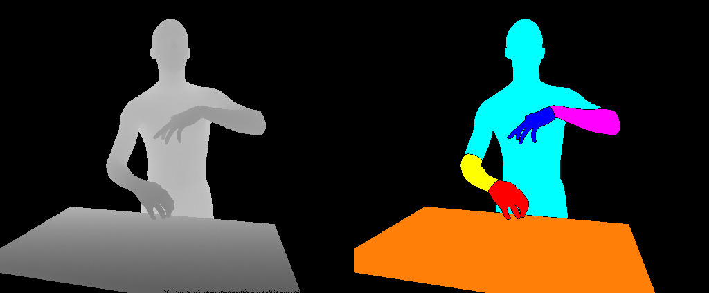

# Hand and Object Segmentation from Depth Image using Fully Convolutional Network



This repo contains the dataset and sample code for the paper: Hand and Object Segmentation from Depth Image using Fully Convolutional Network.

[**Paper**](https://doi.org/10.1109/EMBC.2019.8857700) | [**Project**](https://gmntu.github.io/hoseg/) | [**Video**](https://www.youtube.com/watch?v=SNuUrp2QiqY)


If you find our work useful, please consider citing
```BibTeX
@inproceedings{hoseg:2019,
  title     = {Hand and Object Segmentation from Depth Image using Fully Convolutional Network},
  author    = {Guan Ming, Lim and Prayook, Jatesiktat and Christopher Wee Keong, Kuah and Wei Tech, Ang},
  booktitle = {41st Annual International Conference of the IEEE Engineering in Medicine and Biology Society (EMBC)},
  year      = {2019}
}
```

## Overview of dataset
1) [Synthetic train set](https://github.com/gmntu/semseg/tree/master/dataset/train_syn) contains 10,000 images for training the FCN model.

2) [Synthetic test set](https://github.com/gmntu/semseg/tree/master/dataset/test_syn) contains 1000 images for evaluation.

3) [Real test set](https://github.com/gmntu/semseg/tree/master/dataset/test_kv2) contains 1000 images captured from a Kinect V2 RGBD camera for evaluation.

4) [Synthetic train set (Fixed body shape)](https://github.com/gmntu/semseg/tree/master/dataset/train_fixbody_syn) contains 10,000 images that is similar to [Synthetic train set](https://github.com/gmntu/semseg/tree/master/dataset/train_syn), except that all the human models have the same body shape. Its main purpose is to compare and show the improvement in FCN performance when the FCN is trained on [Synthetic train set](https://github.com/gmntu/semseg/tree/master/dataset/train_syn) with varying body shapes.


Code snippet for loading and displaying dataset

```python
import cv2
import numpy as np

def convertLabel2Color(label):
	height, width = label.shape
	label_color = np.zeros((height, width,3), np.uint8)
	label_color[label == 1] = [255,255,0] # Cyan   -> Foreground Note BGR
	label_color[label == 2] = [255,0,0]   # Blue   -> Left hand
	label_color[label == 3] = [0,0,255]   # Red    -> Right hand
	label_color[label == 4] = [255,0,255] # Magenta-> Left Arm
	label_color[label == 5] = [0,255,255] # Yellow -> Right Arm
	label_color[label == 6] = [0,255,0]   # Green  -> Obj    
	label_color[label == 7] = [9,127,255] # Orange -> Table    
	return label_color

depth = cv2.imread('../dataset/train_syn/depth/0000000.png', cv2.IMREAD_ANYDEPTH)
label = cv2.imread('../dataset/train_syn/label/0000000.png', cv2.IMREAD_GRAYSCALE)

cv2.imshow('depth', cv2.convertScaleAbs(depth, None, 255/1500, 0))
cv2.imshow('label', convertLabel2Color(label))
cv2.waitKey(0)
```

## Fully Convolutional Network (FCN) model
Refer to [model](https://github.com/gmntu/hoseg/blob/master/code/model.py) and the [trained weights](https://github.com/gmntu/hoseg/blob/master/code/model_FCN_NEW.pkl)

## Real-time demo using Kinect V2
Refer to [kinect.py](https://github.com/gmntu/hoseg/blob/master/code/kinect.py)